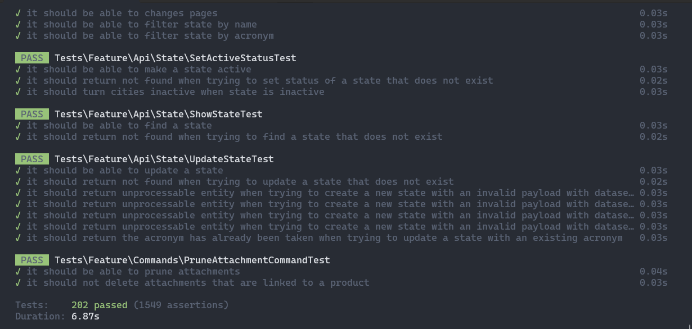

# Grupo Criar - Desafio Web Back-End

## Sobre o projeto

O projeto é um grupo criar, onde você deve criar uma api para gerenciar estados, cidades, clusters, campanhas, descontos e produtos.

## Tecnologias Utilizadas

- PHP 8.4
- Laravel Framework
- Swoole (Laravel Octane)
- MySQL
- Docker e Docker Compose
- Pest (Testes)
- Scrumble (Documentação)

## Instalação

### Requisitos

- [Docker](https://docs.docker.com/engine/install/)
- [Docker Compose](https://docs.docker.com/compose/install/)

### Executando o projeto

1. Clone o repositório

```bash
git clone https://github.com/gustavocabreira/grupo-criar-api.git
```

2. Entre na pasta do projeto

```bash
cd grupo-criar-api
```

3. Entre na pasta docker/local

```bash
cd docker/local
```

4. Execute o comando para instalar o projeto

```bash
sh install.sh --app-name=grupo-criar-api
```

5. Após a instalação, utilize o comando para iniciar o projeto

```bash
sh start.sh
```

6. Acesse a aplicação em http://localhost

7. Você pode acessar a documentação do projeto em http://localhost/docs/api

## Exemplo de requisição

```sh
curl --request POST \
  --url http://localhost/api/states \
  --header 'Accept: application/json' \
  --header 'Content-Type: application/json' \
  --data '{
  "name": "string",
  "acronym": "st"
}'
```

## Código de respostas HTTP

| Código | Descrição             |
|--------|-----------------------|
| 200 | OK                    |
| 201 | Created               |
| 204 | No Content            |
| 404 | Not Found             |
| 422 | Unprocessable Entity  |
| 500 | Internal Server Error |

## Fluxgrama de uso


## Testes

Os testes do projeto estão no diretório `tests/` e foram desenvolvidos utilizando o pacote [Pest](https://pestphp.com/docs/installation).
Pest é uma biblioteca de testes para PHP que permite escrever testes de forma fácil e rápida.

Para executar os testes, siga os passos abaixo:

1. Acesse o diretório /docker/local
2. Execute o comando para interagir com o container

```bash
docker compose exec -it laravel sh
```

3. Execute o seguinte comando

```bash
php artisan test
```

### Execução dos testes


### Cobertura de testes

